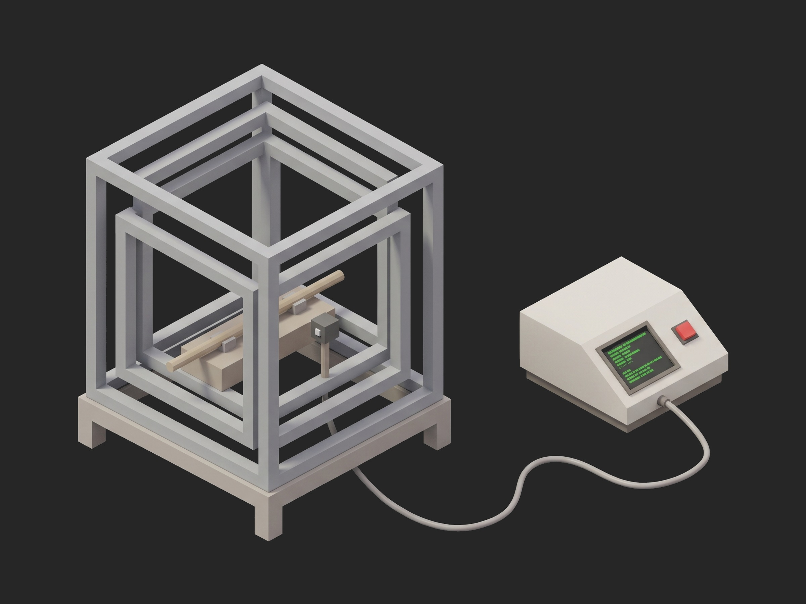

# Framework Magnetorquer Dipole Moment Test



A TofuPilot Framework procedure for the acceptance of a 1 A·m² torque rod in a Helmholtz cage: the cage residual and the rod's axis marking in setup, coil resistance four-wire and insulation to the case at 500 V, a current sweep from -150 to +150 mA with the axial field at a fluxgate converted to dipole through the on-axis law and judged on the value at rated current, the straightness of the curve, the gain and the polarity against the marking, then the remanent dipole with the current cut after a rated pulse. The mock bench synthesizes a healthy rod with a soft-saturating core and 0.6 % remanence.

## What This Shows

| Feature | Where |
|---------|-------|
| A physical conversion in the phase, the instrument reads field, the record stores dipole | `dipole_sweep` -- on-axis law with the sensor distance from the recipe |
| Three aggregations on one curve: a value, a slope, a deviation | `sweep.dipole` -- `at_rated_am2`, `gain_am2_per_a`, `linearity_pct` |
| A string measurement validated with `==` | `polarity == "+X"` |
| A facility floor validated in setup and written to the unit metadata | `cage_residual_nt <= 50`, `unit.metadata["sensor_distance_m"]` |
| A tolerance window as two validators | `coil_resistance_ohm` in 31.35 to 34.65 |
| Zero reference re-read in the phase that needs it | `residual` reads the cage again rather than the setup value |
| Setup gate, teardown that leaves the cage known, `depends_on` chain | `procedure.yaml` |

## Get Started

1. Sign up for a free TofuPilot account at [tofupilot.app](https://www.tofupilot.app/auth/signup).
2. Open the **New Procedure** flow in the dashboard and clone this template.
3. Follow the dashboard's instructions to set up a station and run the procedure.

For deeper guides, see the [TofuPilot docs](https://www.tofupilot.com/docs/framework) and the [Magnetorquer Dipole Moment Test template page](https://www.tofupilot.com/templates/magnetorquer-dipole-moment-test).

## Structure

```
.
├── procedure.yaml                    # Procedure, plug, phases, measurements
├── phases/
│   ├── identify.py                   # Setup: marking, sensor distance, cage nulled
│   ├── electrical.py                 # Coil resistance, insulation at 500 V
│   ├── dipole_sweep.py               # -150 to +150 mA, field to dipole, fit, polarity
│   ├── residual.py                   # Remanent dipole after a rated pulse
│   └── power_off.py                  # Teardown: current off, last field reading
├── plugs/
│   └── torquer_bench.py              # Mock cage + fluxgate + source + meters
├── utils/
│   └── recipe.py                     # Rod data, sweep, limits, sensor distance
├── pyproject.toml                    # uv-managed Python project
└── README.md
```

## Replace the Mock with Real Hardware

`plugs/torquer_bench.py` maps to a Bartington Mag-03 or Mag-13 fluxgate read through a Spectramag or NI DAQ, a three-axis Helmholtz cage driven by three bipolar supplies with the nulling done by the bench, a Keithley 2450 as the coil current source, a Hioki RM3545 for the four-wire resistance and a Megger MIT for the insulation, through a switch box. Set `SENSOR_DISTANCE_M` to the measured distance on the fixture and `CAGE_RESIDUAL_NT_MAX` to what the facility achieves. The phases, measurements and limits stay the same.
